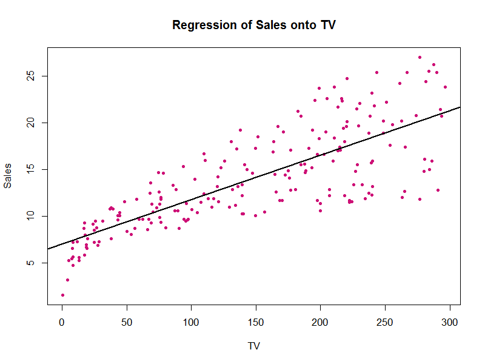

---
title: "Multiple Linear Regression Analysis"
author: "Gary Thuc Nguyen"
date: "October 14, 2016"
output: pdf_document
    
<!-- Don't edit in between this line and the one below -->
```{r include=FALSE}
# Don't delete this chunk if you are using the DataComputing package
library(DataComputing)
```
*Source file* 
```{r, results='asis', echo=FALSE}
includeSourceDocuments()
```
<!-- Don't edit the material above this line -->

# Abstract

This homework is to reproduce the analysis from Section 3.2 (pages 71 to 82), from the book "An Introduction to Statistical Learning" (by James et al). It includues multiple linear regressin with the predictor variables TV, Radio, Newspaper and the response variable Sales.

# Introduction

Fitting a linear model is the objective of the analysis. The explonatory variable is "Sales", and the response variable is "TV". After we have produced a linear regression line running through the cluttered data points, the fit of that model will be assesed through different coefficients given in the Summary of the regression model.

# Data

The dataset Advertising.csv comes from "http://www-bcf.usc.edu/~gareth/ISL/Advertising.csv It consists for TV, Radio, Newspaper and Sales columns. The structure of the columns are stored in numeric vectors.

Advertising data set consists of Sales (in thousands of units) in 200 different markets, along with advertising budgets for the product in each of those markets for three different media: TV, radio, and newspaper. In this analysis, we will only look into the relationship between product Sales and TV advertising budgets, response and predictor variables respectively.

# Methodology

In homework 2, the Simple Linear Model that is used to evaluate the association between Sales and TV:

$$ \hat{Sales} = \hat{\beta_0} + \hat{\beta_1} \times TV $$

Using the least squares criterion, estimates of the beta coefficients are calculated to form a fitted regression line from the given n = 200 observations.

For multiple linear regression:

$$Sales = \beta_{0}+\beta_{1} * TV + \beta_{2}*Radio + \beta_{3}*Newspaper$$

Multiple Linear regression is useful for Advertising data becasue it can determined the relationship between sales and the three types of advertising. We can compare which type of advertisement is more effective and has a stronger association with sales. 

### Estimating the Regression Coefficients
Using the formula below, we estimate the regression coefficients:

$$\hat{y} = \hat{\beta_0} + \hat{\beta_1}  X_1 + \hat{\beta_2} X_2 ... + \hat{\beta_p}  X_p$$

Then we minimize the sum of squared residuals:

$$ RSS = \sum_{i=1}^n\left(y_i-\hat{y_i}\right)^2 = \sum_{i=1}^n\left(y_i - \hat{\beta}_0 - \hat{\beta_1}x_{i1} - \hat{\beta_2}x_{i2} - ... - \hat{\beta_p} x_{ip}\right)^2 $$

### F-statisitc

 We test the null hypothesis to estimate regression coefficients:

$$H_0 = \beta_1 = \beta_2 = ... = \beta_p = 0$$

versus the alternative : $H_a$: at least one $\beta_j$ is non-zero.

 *F-statistic* is computed below:

$$F = \frac{(TSS - RSS)/p}{RSS/(n-p-1)}$$

When there is no relationship between the response and predictors, the F-statistics will be close to 1. On the other hand, if $H_a$ is true, we expect `F` to be greater than 1. 

# Results

Plot of Least Squares for simple regression 
between TV and Sales



The 3 tables give us information about how fit linear models are for Sales vs. TV, Sales vs. Radio, Sales vs. Newspaper

```{r xtable, results = 'asis',warning=FALSE, message=FALSE, echo=FALSE, comment = FALSE}
load("../data/regression.RData")
library(xtable)
# table 1:
print(xtable(summary(reg_TV)$coef, caption = "Simple regression of Sales on TV", type = "Latex"),comment = FALSE)
# table 2:
print(xtable(summary(reg_Radio)$coef, caption = "Simple regression of Sales on Radio", type = "Latex"), comment = FALSE)
# table 3:
print(xtable(summary(reg_Newspaper)$coef, caption = "Simple regression of Sales on Newspaper", type = "Latex"), comment = FALSE)
```

Table 1 displays the simple linear regression fit to the `Advertising` data, where $\hat{\beta_0}$ = `r reg_TV$coefficients[[1]]` and $\hat{\beta_1}$ = `r reg_TV$coefficients[[2]]`. 

With $1000 increase in TV advertisement, there will be an increase in sales by 50 units. 
 

Table 2 displays the simple regression of `Sales` on `Radio`, where $\hat{\beta_0}$ = `r reg_Radio$coefficients[[1]]` and $\hat{\beta_1}$ = `r reg_Radio$coefficients[[2]]`. We find that a $1,000 increase in spending on radio advertising is associated with an increase in sales by around `r round(reg_Radio$coefficients[[2]]*1000,1)` units. 

With $1000 increase in Radio advertisement, there will be an increase in sales by 200 units. 


Table 3 contains the least squares coefficients for a simple linear regression of slaes onto `Newspaper` advertising budget, where $\hat{\beta_0}$ = `r reg_Newspaper$coefficients[[1]]` and $\hat{\beta_1}$ = `r reg_Newspaper$coefficients[[2]]`. A $1,000 increase in newspaper advertising budget is associated with an increase in sales by approximately `r round(reg_Newspaper$coefficients[[2]]*1000,1)` units.

With $1000 increase in Newspaper advertisement, there will be an increase in sales by 50 units. 


```{r, results = 'asis',warning=FALSE, message=FALSE, echo=FALSE, comment = FALSE}
load("../data/regression.RData")
load("../data/correlation-matrix.RData")

# table 4
print(xtable(summary(reg_multi)$coef, caption = "Coefficient estimates of the least squares model", type = "Latex"), comment = FALSE)
```

By using multiple linear regression, we can see how other predictors changed the sales. From Table 4, we can see that there will be approximately 50 units increase in sales with $1000 budget. Radio still have a better effect of increase in 190 units in sales. However, newspaper has a decrease in sales. Thus, we can concluded that radio advertisement is more effective, while newspaper plays a less importatnt role in terms of affect sales. Both TV and radio have low p-values, which means there is a relationship between sales with TV and radio. Newspaper has 0.86 p-value, which means there is no relationship between Newspaper and Sales. 

```{r, results = 'asis',warning=FALSE, message=FALSE, echo=FALSE, comment = FALSE}
# table 5:
corm_eda[lower.tri(corm_Advertising)] <- NA
print(xtable(corm_Advertising, caption = "Correlation matrix for TV, radio, newspaper, and sales for the Advertising data", type = "Latex"), comment = FALSE)

```


From Table 5, we can first examined R squared, which is .90. This means the data is a good fit to the regression line. The F-statistics is high, which mean at least one advertisement has a correlation with Sales.

```{r,results = 'asis',warning=FALSE, message=FALSE, echo=FALSE, comment = FALSE}
source("../code/functions/regression-functions.R")
#table 6: 
f = round(F_statistic(reg_multi),1)
rse = round(Residual_ss(reg_multi),2)
r2 = round(R_squared(reg_multi),3)
c = c("Residual standard error","R2", "F-statistic")
v = c(rse,r2,f)
qq = data.frame(c,v)
colnames(qq) <- c("Quantity","Value")
print(xtable(qq, type = "html", caption = "Regression Quality Indices: regression of Sales on TV, radio and nespaper"),comment = FALSE, include.rownames = FALSE)
```


#Conclusions
From the first three tables of single linear regression model, we find that TV and newspaper advertissment have approximately the same outcome for sales. The major difference is radio advertisement and the marketing team should consider spend more budget on it. 
By examining the high f-statistics, we can tell that at least one of the predictors useful in predicting the response. The multiple regression model show us that TV and Radio are useful to explain the increase of sales. From the coefficients in the multiple linear regression model, we can see that Radio has the highest effect to increase sales. Newspaper has a negative coefficient and high p-value, which mean there is no relationship between newspaper and sales. The high R squares shows that the model is a good fit to the data; thus, the prediction will be quite accurate. 

